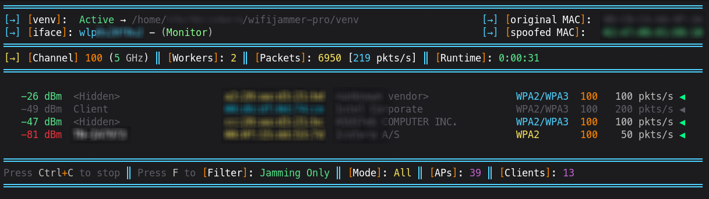

# 🔥 wifijammer-pro

### WiFi Deauthentication Tool for Penetration Testing

[](https://www.python.org/)
[](LICENSE)
[](https://archlinux.org/)
[](https://www.debian.org/)
[](https://www.kali.org/)
[](https://github.com/S3rd4t4/wifijammer-pro/tree/main)


---

## ✨ Features

| Feature | Description |
|---------|-------------|
| 🚀 **Multi-threaded Workers** | High-performance concurrent deauthentication attacks |
| 📊 **Real-time Monitoring** | Live attack statistics and packet tracking |
| 🎯 **Targeted & Broadcast** | Attack specific networks or all nearby targets |
| 🎨 **Rich Terminal UI** | Color-coded output with clear status indicators |
| 📡 **Dual-Band Support** | Works on 2.4GHz and 5GHz frequencies |
| 🔧 **Auto Configuration** | Automatic monitor mode and dependency installation |

---

## 📸 Preview



---

## ⚙️ Requirements

| Component | Requirement |
|-----------|-------------|
| **Operating System** | Linux (Debian & Arch) |
| **Wireless Adapter** | Monitor mode & packet injection support |
| **Privileges** | Root/sudo access required |
| **Python Version** | Python 3.6 or higher |

**Dependencies:** aircrack-ng, wireless-tools, scapy *(auto-installed)*

---

## 🚀 Installation

```bash
# Clone the repository
git clone https://github.com/S3rd4t4/wifijammer-pro.git

# Navigate to project directory
cd wifijammer-pro

# Make script executable
chmod +x wifijammer.py

# Run the script (dependencies will auto-install on first run)
sudo ./wifijammer.py
```

---

## 💻 Usage

```bash
# Run the script with interactive menu
sudo python3 wifijammer.py
```

### How It Works

| Step | Action | Description |
|------|--------|-------------|
| **1** | 🔌 Interface Detection | Automatically identifies available wireless interfaces |
| **2** | 📡 Monitor Mode | Enables monitor mode on selected interface |
| **3** | 🔎 Network Scanning | Scans for nearby WiFi networks and clients |
| **4** | 🎯 Target Selection | Choose specific BSSID or broadcast mode |
| **5** | ⚙️ Worker Configuration | Set number of concurrent attack workers |
| **6** | ⚡ Attack Execution | Send deauthentication packets to targets |
| **7** | 📊 Live Monitoring | Display real-time statistics and packet count |
| **8** | 🛑 Graceful Shutdown | Restore interface and cleanup on exit |

---

## ⚠️ Legal Disclaimer

> **🚨 FOR EDUCATIONAL AND AUTHORIZED TESTING ONLY 🚨**
>
> Unauthorized WiFi deauthentication attacks are illegal under computer fraud and telecommunications laws worldwide (CFAA, Computer Misuse Act, EU Directive 2013/40/EU, etc.).
>
> **By using this tool, you agree to:**
> - Obtain proper written authorization before testing
> - Only test networks you own or have permission to test
> - Accept full responsibility for your actions
>
> The author is not responsible for misuse or damage caused by this tool.

---

## 🤝 Contributing

Contributions are what make the open-source community amazing! Any contributions are greatly appreciated.

```bash
# Fork the repository
git fork https://github.com/S3rd4t4/wifijammer-pro

# Create your feature branch
git checkout -b feature/AmazingFeature

# Commit your changes
git commit -m 'Add some AmazingFeature'

# Push to the branch
git push origin feature/AmazingFeature

# Open a Pull Request
```

---

## 👤 Author

[](https://github.com/S3rd4t4)

**Repository:** [wifijammer-pro](https://github.com/S3rd4t4/wifijammer-pro)

---

## 📄 License

[](LICENSE)


This project is licensed under the **MIT License** - see the [LICENSE](LICENSE) file for details.

---

## ⭐ Show Your Support

If you find this project useful, please consider giving it a star! It helps others discover the tool and supports continued development.

[](https://github.com/S3rd4t4/wifijammer-pro/stargazers)

---

<div align="center">

Made with ❤️ for the **Cybersecurity Community**

</div>
